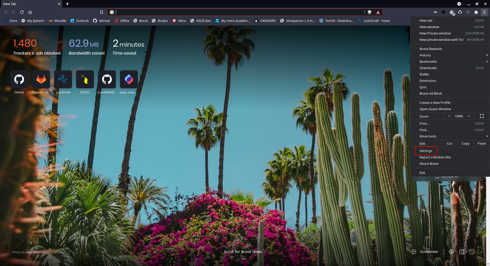
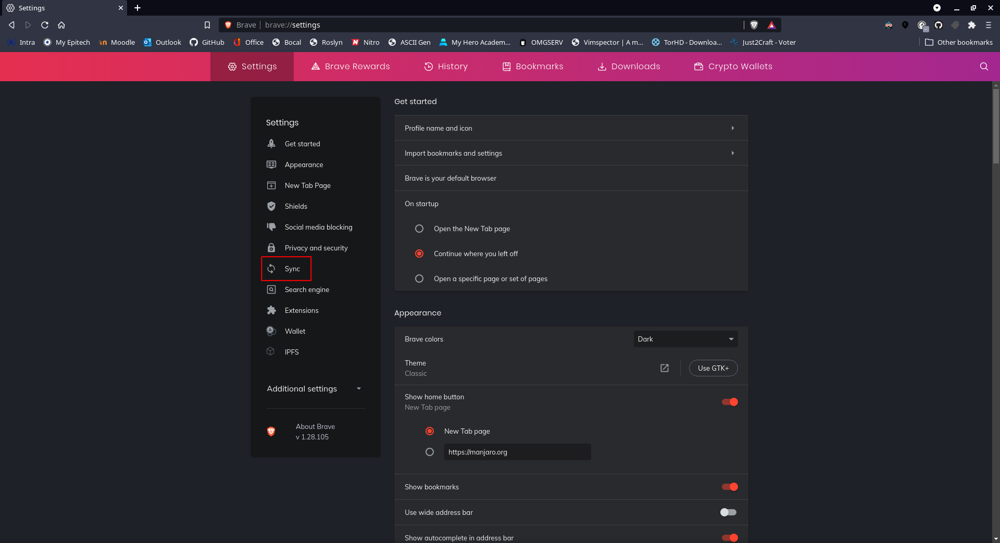
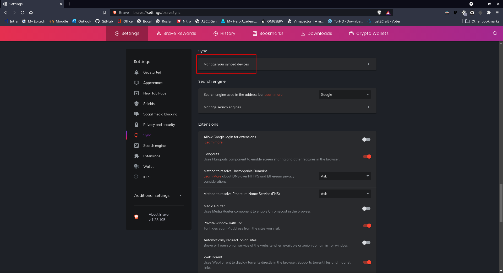
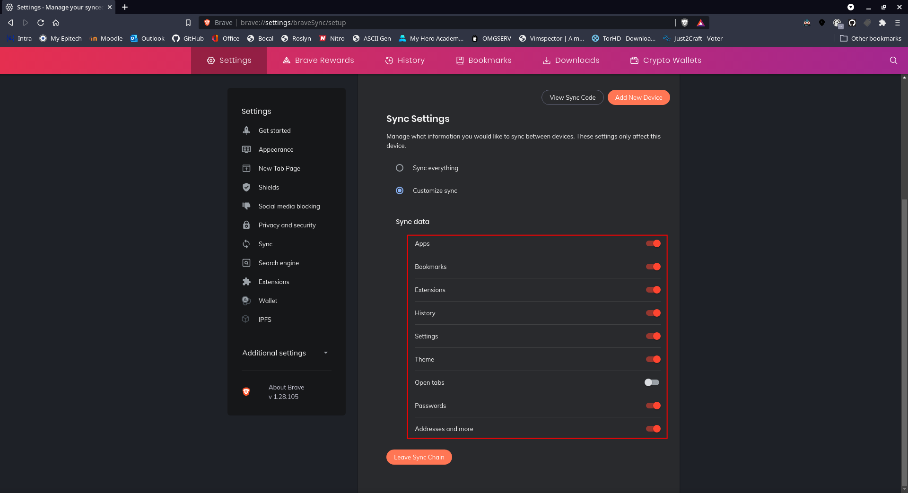

# Brave configuration

#### What is done by scripts ?
None of this section

### How to configure brave

Launch brave

Go in `Settings`

Go in `Sync`

Click on `Manage your synced devices`

Use sync code (send to Mee6 by discord for me)

Check all options except `Open tabs`

## Next doc

Now it's time to check [zsh doc](zsh.md)
