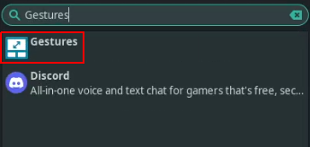
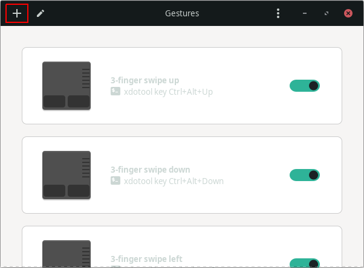

# Gestures configuration

#### What is done by scripts ?

Setup of the service

[Scripts doc](scripts.md)

#### What is not done by scripts ?

Create shortcuts

### Setup service

Add user to input group:

```bash
sudo gpasswd -a $USER input
```

Setup systemd service:

```bash
libinput-gestures-setup stop desktop autostart start
```

Enable service autostart:

```bash
libinput-gestures-setup autostart
```

Start service:

```bash
libinput-gestures-setup start
```

### Create shortcuts

Launch `Gestures`



Add new shortcuts:



Then add this shortcuts with `Swipe`, `Three fingers`:

- Up: `xdotool key Ctrl+Alt+Up`
- Down: `xdotool key Ctrl+Alt+Down`
- Left: `xdotool key Ctrl+Alt+Left`
- Right: `xdotool key Ctrl+Alt+Right`

Reboot:

```bash
reboot now
```

## Next doc

Now it's time to check [discord doc](discord.md)
