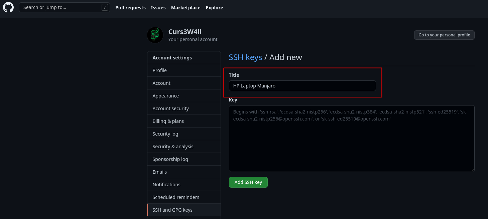
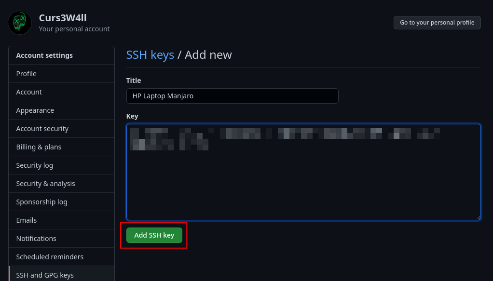
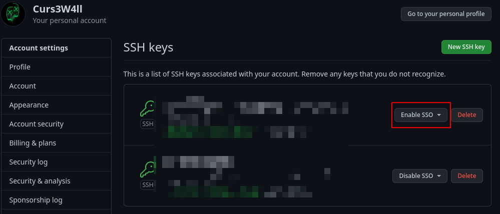
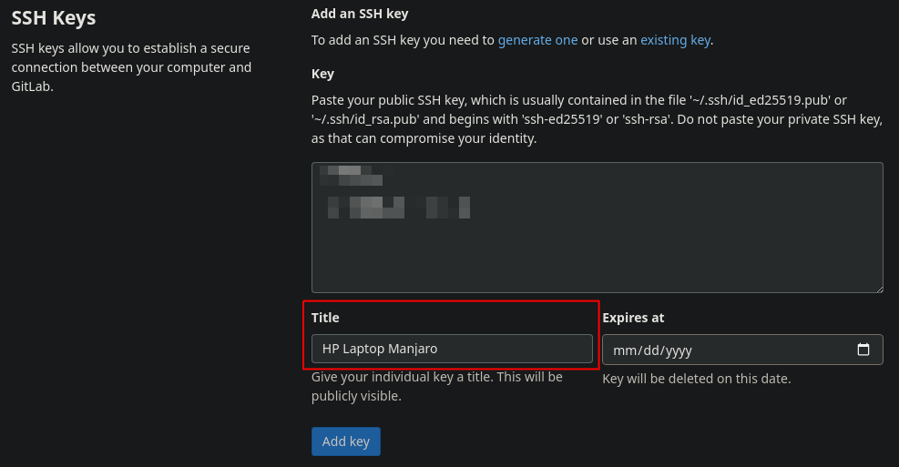
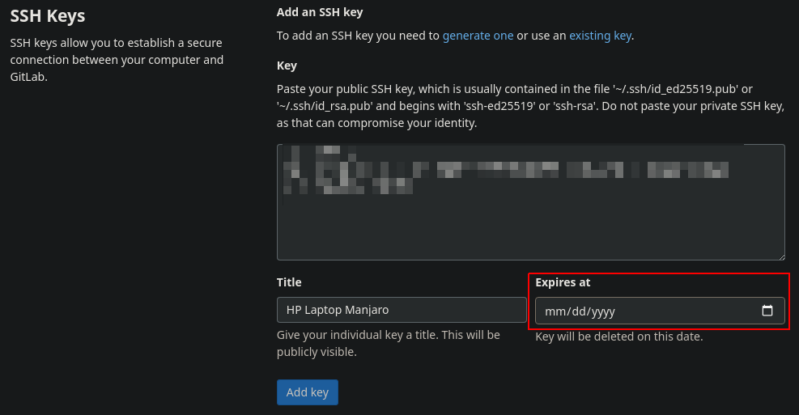
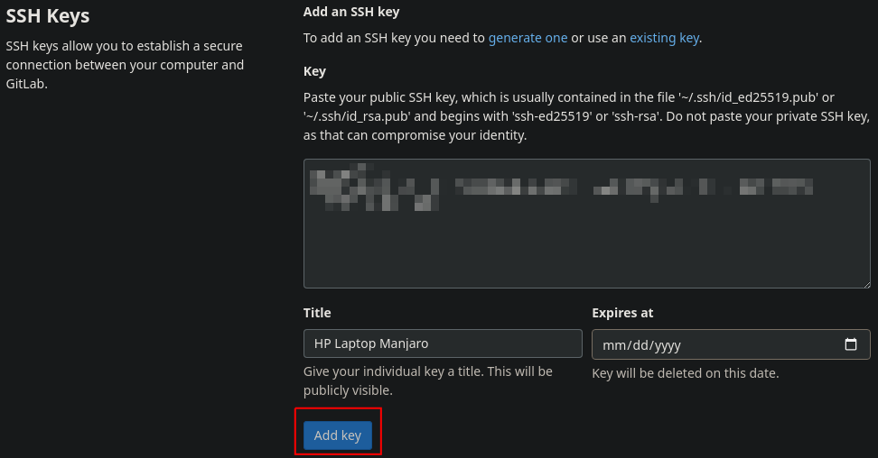

# Git configuration

#### What is done by scripts ?

Local git configuration

New ssh key generation

[Scripts doc](scripts.md)

#### What is not done by scripts ?

Github and gitlab ssh key linkage

### Configure git

Configure commit profile name:

```bash
git config --global user.name "Corentin Hervaud"
```

Configure commit profile mail:

```bash
git config --global user.email "corentin.hervaud@epitech.eu"
```

### Create ssh key

Generate a new ssh key (you can change the `-C`):

```bash
ssh-keygen -t ed25519 -C "chervaud@hp_manjaro"
```

Add ssh key to ssh-agent:

```bash
ssh-add ~/.ssh/id_ed25519
```

### Add ssh key on github

Go to [github ssh keys](https://github.com/settings/keys)

Click `New SSH key`


Set a title, example: 'HP Laptop Manjaro'



Copy your ssh public key located at: `~/.ssh/id_ed25519.pub`

Click `Add SSH Key`



Click `Enable SSO` and follow the instructions, this enable epitech connection to your github account



### Add ssh key on gitlab

Go to [gitlab ssh keys](https://gitlab.com/-/profile/keys)

Copy your ssh public key located at: `~/.ssh/id_ed25519.pub`

Set a title, example: 'HP Laptop Manjaro'



Add an expiration date if you want (no one means no expiration date)



Click `Add Key`



## Next doc

Now it's time to check [docker doc](docker.md)
