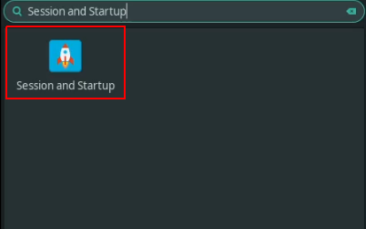

# System configuration

#### What is done by scripts ?

Date synchronization

Desktop icons hiding

Background image set

#### What is not done by scripts ?

All the rest

### Enable touchpad clicktouch

Launch `Mouse and Touchpad`


Select the Touchpad in the devices list


Click on sub section `Touchpad`


Check `Tap touchpad to click`


### Change system theme

Launch `Appearance`


Select the theme you want (recommended: `Matcha-dark-sea`)


### Change backgrounds

Right click on the monitor background you want to change


Change the images source directory


Select the image you want to use as background (one can be found in this repository)


Select the zoomed style and make sure `Apply to all workspaces` is checked


### Hide desktop icons

Right click on the monitor background you want to change


Click on sub section `Icons`


Click on `Icon type` select button


Select `None`


### Create shortcuts

Launch `Keyboard`


Click on sub section `Application Shortcuts`


Add this shortcuts:


|Command                 |keys                |
|:-----------------------|:-------------------|
|`terminator`            |Ctrl + Alt + I      |
|`brave`                 |Ctrl + Alt + O      |
|`discord`               |Ctrl + Alt + U      |
|`xfce4-screenshooter -r`|Print               |
|`xfce4-screenshooter -f`|Ctrl + Shift + Print|

### Enable pacman colored output

Open `/etc/pacman.conf`:

```bash
sudo vim /etc/pacman.conf
```

Uncomment the line `Color`


### Config paru

Open `/etc/paru.conf`:

```bash
sudo vim /etc/paru.conf
```

Uncomment the line `BottomUp`

Uncomment the line `Sudoloop`

Uncomment the line `UseAsk`

### Enable system date synchronization

Enable system date sync

```bash
timedatectl set_ntp true
```

Restart systemd timesync service

```bash
systemctl restart systemd-timesyncd.service
```

### Add workspaces

Launch `Workspaces`


Add or remove as many workspaces as you want


### Change theme

Install your theme(example: `la-capitaine`)

```bash
paru la-capitaine
```

Change it in your settings

Launch `Appearance`


Click on `Icons` subtab


Select `La Capitaine`


### Install plank TabBar

Plank is a nice tabbar

Install Plank

```bash
paru plank
```

Add it in the autostart applications

Launch `Session and Startup`



Click on `Application Autostart`


Click on the 'Plus'


Fill like following


Disable dock windows shadows

Launch `Window Manager Tweaks`


Click on `Compositor` subtab


Uncheck `Show shadows under dock windows`


### Custom panel bar

Move panel bar to the top

Open panel bar preferences by rightclikcing it


Click on `Items` subtab


Organize items as following


## Next doc

Now it's time to check [brave doc](brave.md)
